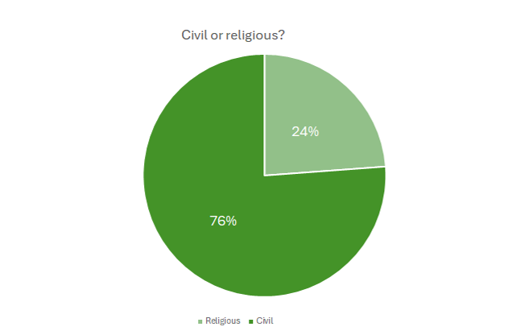
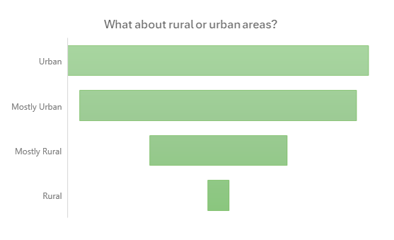
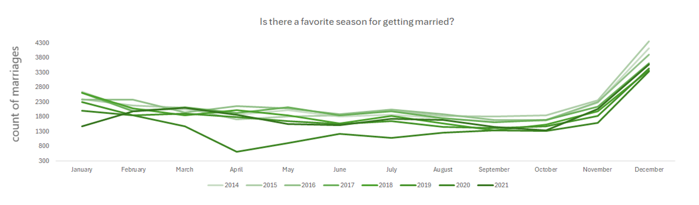
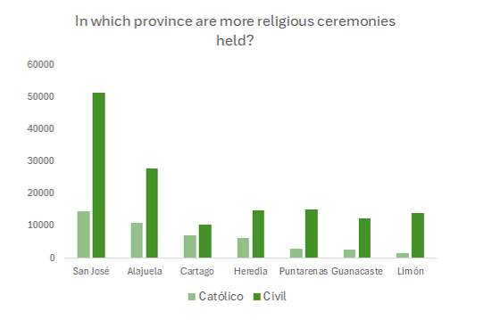

# **Costa Rica Marriage Trends (2014–2021)**   
**By Irina Orias Mendoza**

---

## Executive Summary

---

### Objective & Business Impact

This project analyzes Costa Rican marriage trends (2014–2021) using Microsoft Excel to uncover patterns in age, location, marriage type, and seasonality — enabling public offices, event planners, and policymakers to allocate resources more effectively, plan around peak periods, and adapt civil services to evolving social preferences.

---

### Key Insights

- **Age Differences**  
  Women marry at a younger average age than men across all years.

- **Provincial Trends**  
  **San José** consistently recorded the highest number of marriages.

- **Marriage Type**  
  **Civil marriages outnumber religious marriages** in every province analyzed.

- **Seasonal Behavior**  
  **December** stands out each year as the most popular month for weddings.
---

## Data Overview

**Source:**  
The dataset used for this project was obtained from [Kaggle](https://www.kaggle.com/datasets/liamarguedas/costa-rica-total-marriages-2014-2021), where it was published based on official records from Costa Rica's **Instituto Nacional de Estadística y Censos (INEC)**. It contains **191,562 marriage records** from 2014 to 2021, including variables such as age, gender, type of marriage, location, and more.

**Features:**  
Includes marriage details such as:

- **Dates:** Year/month of processing, marriage, and declaration  
- **Marriage Type:** Civil or religious  
- **Couple Type & Gender:** For both spouses  
- **Age:** Exact age, age at marriage, and age range  
- **Nationality & Country:** Of both spouses  
- **Occupation:** Of both spouses  
- **Previous Marital Status:** Civil status and number of past marriages  
- **Geographic Info:** Province, canton, and district of residence and occupation  
- **Zone:** Urban or rural

##  Exploratory Data Analysis

**Key Trends and Observations:**

- **Civil marriages dominate** across all provinces, with significantly higher counts than religious ceremonies.
- **Women marry younger** than men on average in every region and year.
- **San José consistently leads** in number of marriages performed and declared.
- **December is the most popular month** for weddings, showing clear seasonal peaks.
- **Urban zones report more marriages** than rural areas, indicating population density impact.

 ### Civil Marriages Dominate Over Time  

### Urban Areas Concentrate the Majority of Marriages  

### December: The Most Popular Month for Weddings  

### San José: Consistently Leading in Marriage Volumes  

**Notable Outliers:**

- Some entries showed **unrealistic ages** (e.g., 0 years) — filtered during data cleaning.
- **Inconsistencies in month names** (e.g., "Setiembre") were corrected to ensure accurate time-based trends.

## Key Findings

- Civil marriages significantly outnumber religious ones in **all provinces**, highlighting a nationwide preference for civil unions.
- Among all provinces, **San José** stands out as the leading location, reporting the highest number of marriages every year.
- **December** consistently emerges as the peak month for weddings, reflecting cultural and seasonal influences on marriage timing.
- **Urban areas experience higher volumes of marriages** than rural zones, suggesting population density and accessibility affect marriage rates.
- The data shows steady marriage volumes from 2014 to 2021, indicating stable social and demographic trends during this period.

---

## Recommendations

1. **Expand civil marriage service capacity** in urban centers (e.g., San José, Alajuela, Heredia) by increasing **processing stations or appointment slots by 20% within the next 12 months** to meet the high and consistent demand identified in the data.

2. **Upgrade civil registry systems** in high-volume provinces by implementing **digital pre-registration and appointment booking tools by the end of Q3** to reduce in-office wait times and administrative backlog.

3. **Adjust staffing schedules** to increase personnel availability by **at least 15% during December and January**, based on historical peak volume trends, while redistributing workloads from low-demand periods.

4. **Allocate April through October** to conduct **facility maintenance, digitization of records, and staff training sessions**, ensuring these activities are completed without interfering with the December peak season.

5. **Launch localized marketing campaigns or financial incentives** (e.g., **10% discount on civil ceremony fees** or venue partnerships) between **April and October** to increase marriage volumes during historically low-activity periods and support small event vendors.

## Conclusion

This project converted over **191,000 official marriage records** into a **strategic decision-making tool**. It supports **smarter planning in civil registry services**, informs **targeted policy interventions**, and enables **private sector actors** to align offerings with clear **seasonal and geographic patterns** in Costa Rica's marriage behavior.
